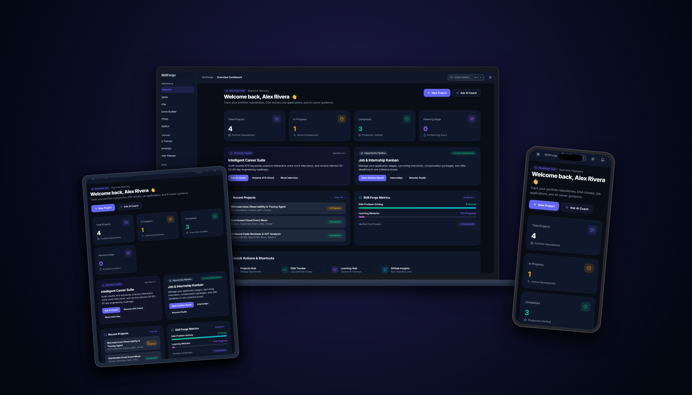

<div align="center">

# SkillForge

**A full-stack career and learning tracker built for software engineers.**

[](https://nodejs.org/)
[](https://expressjs.com/)
[](https://www.mongodb.com/)
[](LICENSE)

[Live Demo](https://skillforge-whkp.onrender.com) · [Report Bug](https://github.com/ayushkumarjha1/SkillForge/issues)

</div>

---

## 👋 What is SkillForge?

SkillForge is a side project I built to help manage the chaos of learning to code, building projects, and applying to jobs. Instead of using a bunch of scattered Notion templates, Excel sheets, and LeetCode tabs, I decided to build my own full-stack web app to track everything in one place.

It's essentially a personal dashboard where I can track my coding projects, keep a log of data structures and algorithms (DSA) I've solved, manage my job applications, and get AI-powered feedback on my resume and interview skills.

## 🚀 Key Features

* **Command Center Dashboard**: Get a quick overview of your progress across projects, DSA problems, and job applications.
* **Project Portfolio**: Track what you've built, the tech stack used, and live demo links.
* **DSA Tracker**: Keep a log of LeetCode/HackerRank problems you've solved along with your personal notes and solutions.
* **Job Application Kanban**: A simple drag-and-drop style board to track where you are in the interview process.
* **AI Mock Interviews**: Practice your technical communication using your browser's microphone. The app uses the Web Speech API and OpenRouter to simulate a real conversation and provide feedback.
* **Resume Builder**: A built-in tool to help structure and export a clean software engineering resume.

## 🛠️ Tech Stack

I built this using a standard **MERN-ish** stack (but with server-side rendering for speed and simplicity).

* **Backend**: Node.js & Express.js
* **Database**: MongoDB (via Mongoose)
* **Frontend**: EJS (Embedded JavaScript templates), Vanilla CSS, and minimal vanilla JavaScript
* **Authentication**: Express-session & Bcrypt (No third-party auth providers, just classic secure cookies)
* **AI Integration**: OpenRouter API (for LLM routing)
* **Icons**: Lucide Icons

## 💻 Local Setup

If you want to run this locally on your machine, it's pretty straightforward.

### Prerequisites
* Node.js (v18+)
* MongoDB (either running locally or a free Atlas cluster)

### Installation

1. **Clone the repo**
   ```bash
   git clone https://github.com/ayushkumarjha1/SkillForge.git
   cd SkillForge
   ```

2. **Install dependencies**
   ```bash
   npm install
   ```

3. **Set up Environment Variables**
   Rename `.env.example` to `.env` and fill in your keys:
   ```env
   PORT=3000
   MONGO_URI=mongodb+srv://<username>:<password>@cluster...
   SESSION_SECRET=put_something_random_here
   OPENROUTER_API_KEY=your_openrouter_key
   ```

4. **Start the server**
   ```bash
   npm start
   # Or 'npm run dev' if you have nodemon installed
   ```

5. Visit `http://localhost:3000` and create an account!

## 📸 Screenshots

*Check out the `/launch-kit/screenshots` folder for a detailed look at the UI!*

<p align="center">
  
</p>

## 📄 License

This project is open source and available under the [MIT License](LICENSE). 

---
*Built by [Ayush Kumar Jha](https://github.com/ayushkumarjha1)*
