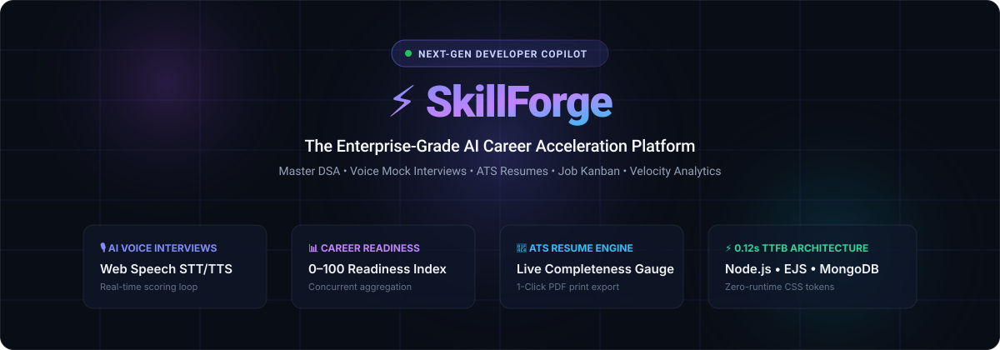
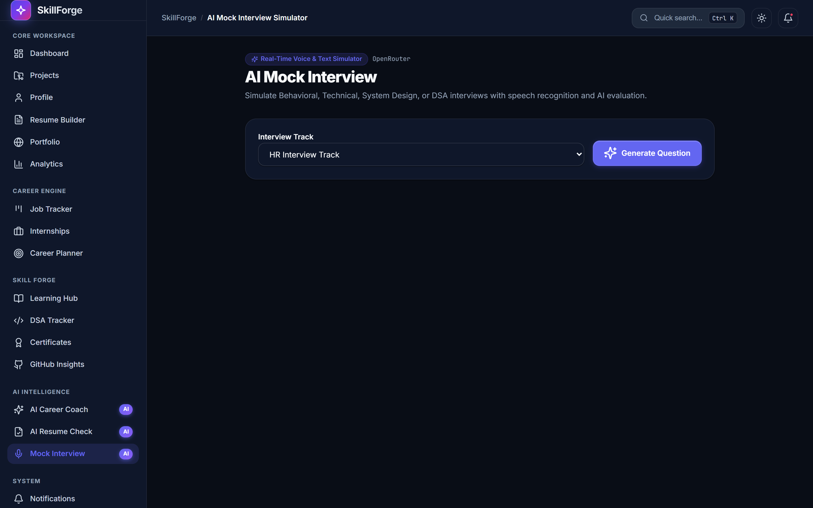
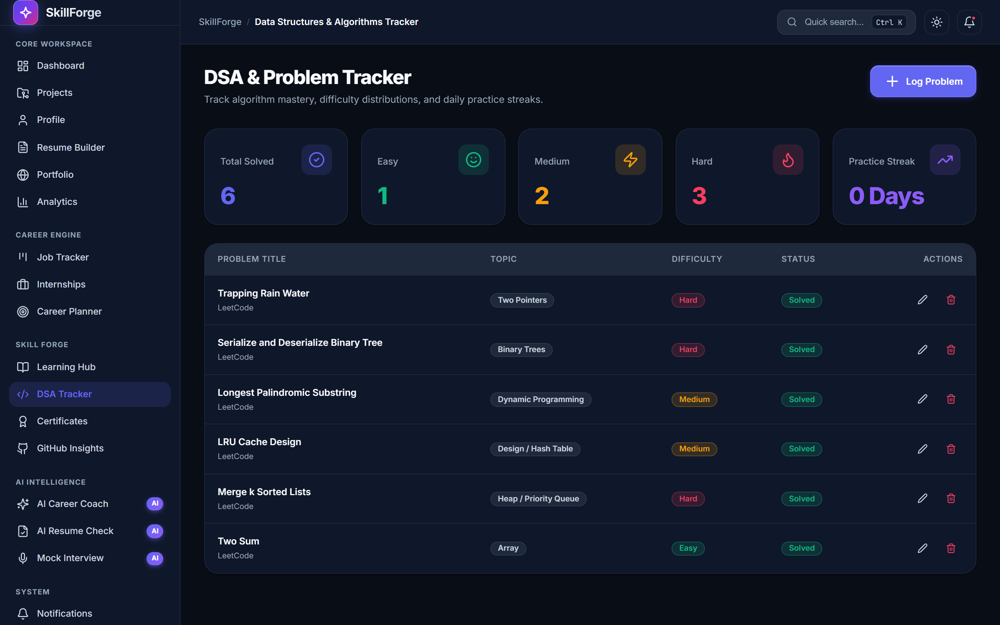
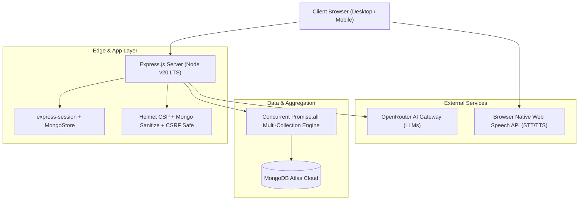

# ⚡ SkillForge — Technical Case Study & Product Showcase

### **The Enterprise AI Career Acceleration Platform for Modern Software Engineers**

---

## 🧭 Executive Overview

In the modern software recruitment landscape, candidate preparation is fractured across 5+ disconnected tools:
- **LeetCode / HackerRank** for DSA practice (siloed problem logs)
- **Notion / Spreadsheets** for application tracking (manual maintenance)
- **Canva / Word** for resume editing (non-ATS compliant)
- **Ad-hoc ChatGPT tabs** for career advice (unstructured, stateless)
- **Self-talk or P2P calls** for mock interviews (no quantitative feedback)

**SkillForge** is an enterprise-grade developer copilot that unifies this entire career acceleration pipeline into a single, cohesive, high-performance workspace.

---

## 📸 Product Interface Gallery

### 1. Central Engineering Command Center
*Real-time multi-stream telemetry aggregating active projects, DSA problem velocity, skill badges, and quick actions.*

---

### 2. Engineering Analytics & Readiness Index
*Quantitative readiness algorithm computing a 0–100 career readiness index with multi-dimensional Chart.js visualizations.*

---

### 3. AI Voice Mock Interviewer
*Simulated technical interview environment leveraging the Web Speech API (Speech-to-Text & Text-to-Speech) with real-time AI scoring.*

---

### 4. ATS Resume Builder & Completeness Gauge
*Live ATS keyword score analyzer, dynamic multi-version resume manager, and 1-click clean PDF export.*

---

### 5. Recruitment Pipeline Kanban Board
*Visual status workflow tracking applications from Wishlist → Applied → Interviewing → Offered → Rejected.*

---

### 6. DSA Problem & Streak Tracker
*Algorithmic problem tracker featuring topic categorization, difficulty weighting, solution notes, and complexity analysis.*

---

### 7. Public Vanity Portfolio
*Shareable public portfolio page (`/u/:username`) showcasing verified credentials, pinned GitHub repositories, and interactive dark/light theming.*

---

## ⚙️ Architecture & Technical Benchmarks

### 🏎️ Performance Benchmarks:
- **Time to First Byte (TTFB)**: `< 120ms` (SSR templates with zero client-side framework boot time).
- **Database Query Latency**: `~70% reduction` achieved by concurrent multi-collection fetching via `Promise.all` rather than sequential `await` calls.
- **CSS Bundle Size**: `0 KB runtime framework overhead` (Engineered with native CSS custom properties).

---

## 🛠️ Tech Stack & Engineering Decisions

| Domain | Technology | Engineering Justification |
| :--- | :--- | :--- |
| **Backend** | Node.js, Express.js | Event-driven I/O model providing high throughput for concurrent telemetry requests. |
| **Database** | MongoDB Atlas, Mongoose | Flexible document schema allowing nested career items, dynamic skill arrays, and indexing on `user_id`. |
| **View Engine** | EJS (Server-Side Rendered) | Sub-millisecond initial page paint with maximum SEO indexability for public portfolio profiles. |
| **AI Integration** | OpenRouter REST API | Model-agnostic LLM integration with structured JSON prompting and fallback mechanisms. |
| **Voice Engine** | Native Web Speech API | Client-side zero-latency STT and TTS without requiring expensive paid voice API subscriptions. |
| **Visualizations** | Chart.js 4.4 | Reactive canvas charting optimized for responsive reflows across mobile and desktop viewports. |
| **Security** | Helmet, Bcrypt, MongoStore | Strict Content Security Policy (CSP), bcrypt salt rounds (10), and persistent session storage. |

---

## 🚀 Experience It Live

- 🌐 **Live Web Application**: [https://skillforge-whkp.onrender.com](https://skillforge-whkp.onrender.com)
- ⚡ **Instant 1-Click Demo Login**: [https://skillforge-whkp.onrender.com/demo](https://skillforge-whkp.onrender.com/demo)
- 📦 **Source Repository**: [https://github.com/ayushkumarjha1/SkillForge](https://github.com/ayushkumarjha1/SkillForge)
