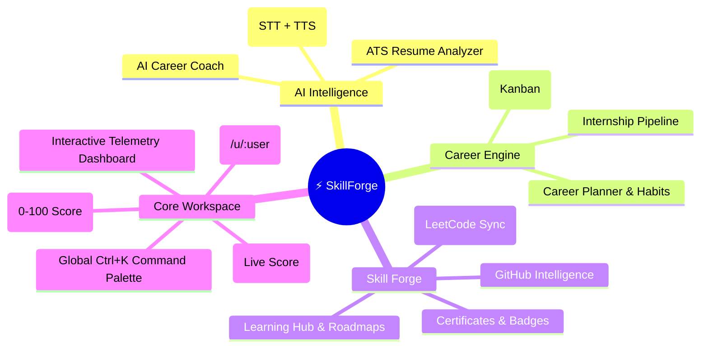
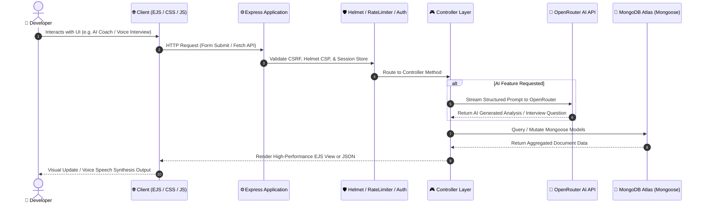

<div align="center">

# ⚡ SkillForge

### **The Enterprise-Grade AI Career Acceleration Platform for Software Engineers**

*Master DSA problems, build ATS-optimized resumes, simulate voice mock interviews, orchestrate job pipelines, and monitor engineering velocity in real time.*

[](https://nodejs.org/)
[](https://expressjs.com/)
[](https://www.mongodb.com/)
[](https://openrouter.ai/)
[](https://developer.mozilla.org/en-US/docs/Web/API/Web_Speech_API)
[](https://www.chartjs.org/)
[](https://opensource.org/licenses/MIT)

<br/>

[Key Features](#-key-features) • [System Architecture](#-system-architecture) • [How to Build This (From Scratch)](#-step-by-step-how-to-build-this-from-scratch) • [Installation & Setup](#-quickstart--installation) • [API & Environment](#-environment-variables) • [Recruiter Deep-Dive](#-engineering-highlights-for-recruiters)

---

</div>

## 📖 Executive Summary

**SkillForge** is a full-stack, AI-powered developer career copilot designed for engineers aiming for top-tier tech roles. It bridges the gap between software engineering education and industry recruitment by unifying **algorithmic problem tracking, portfolio showcase, ATS resume generation, job application Kanban orchestration, voice-enabled AI mock interviews, and quantitative engineering velocity analytics**.

Built with a performance-first mindset, SkillForge uses a **Model-View-Controller (MVC)** architecture with server-rendered EJS templates, vanilla CSS tokens for instant first-paint times, MongoStore-backed session security, OpenRouter LLM APIs, and native browser Web Speech APIs.

---

## 🌟 Key Features



### 1. 🎙️ AI Voice Mock Interviewer
- **Interactive Speech Interface**: Leverages native `SpeechRecognition` (STT) and `SpeechSynthesis` (TTS) to simulate real-time conversational technical and behavioral interviews.
- **Dynamic Persona Selection**: Practice with Frontend, Backend, Full-Stack, System Design, or Behavioral interviewer personas.
- **Instant AI Feedback**: Generates granular feedback on communication clarity, technical depth, and actionable improvements.

### 2. 📄 ATS Resume Studio & Real-Time Scoring
- **Automated Resume Builder**: Create multiple tailored resumes syncing verified profile data and project repositories.
- **Live Completeness Engine**: Real-time client-side scoring evaluates work experience, quantified bullet points, skill density, and educational credentials.
- **ATS Export Engine**: Clean, ATS-parsable, print-optimized formatting ready for 1-click PDF generation.

### 3. 📊 Career Velocity & Quantitative Analytics
- **Career Readiness Index (0–100 Score)**: Dynamic algorithmic scoring based on repository volume, DSA difficulty coverage, active job pipelines, and certifications.
- **Multi-Dimension Charts**: Chart.js visualizations for project development stages, DSA difficulty breakdowns, and recruitment funnels.
- **Intelligent Milestones**: Personalized next-step recommendations derived from user activity patterns.

### 4. 🗂️ Job & Internship Kanban Engine
- **Visual Application Funnel**: Drag-and-drop or status-transition jobs across `Wishlist`, `Applied`, `Interviewing`, `Offered`, and `Rejected`.
- **Telemetry Cards**: Track salary ranges, application dates, referral contacts, and interview rounds.

### 5. 💻 DSA Problem & Streak Tracker
- **Algorithmic Mastery Log**: Track LeetCode/Codeforces problems categorized by data structures (Dynamic Programming, Trees, Graphs, Sliding Window).
- **Difficulty Tagging & Complexity Notes**: Document time/space complexities and solution approaches for rapid interview review.

### 6. 🌐 Public Developer Portfolio & Studio
- **Custom Vanity URLs**: Share your verified profile publicly at `skillforge.dev/u/username`.
- **Live Theme Customizer**: Toggle light/dark showcase themes and pin featured projects directly to your portfolio.

### 7. 🐙 GitHub Intelligence Telemetry
- **Repository Diagnostics**: Fetch commit activity, language breakdown, and repository stats using the GitHub REST API without requiring user OAuth.

---

## 🏗️ System Architecture

SkillForge follows a robust, decoupled **Model-View-Controller (MVC)** design pattern with layered middleware for authentication, security headers, rate limiting, and error handling.

### High-Level Request Flow



### Database Schema (ERD)


---

## 🛠️ Step-by-Step: How to Build This (From Scratch)

If you are a developer looking to build a full-scale AI SaaS platform from scratch, here is the complete blueprint:

### Phase 1: Environment & Project Foundation
1. **Initialize Node Environment**:
   ```bash
   mkdir skillforge && cd skillforge
   npm init -y
   npm install express mongoose dotenv express-session connect-mongo bcryptjs helmet express-rate-limit method-override ejs
   npm install -D nodemon
   ```
2. **Configure Entrypoint (`app.js`)**:
   - Establish Express server, configure `express.urlencoded` and `express.json` body parsers.
   - Configure `helmet` Content Security Policy (CSP) with whitelisted scripts for Lucide and Chart.js.
   - Configure session storage backed by `connect-mongo` to maintain persistent user sessions across server restarts.

### Phase 2: Design Token Architecture & CSS System
1. **Define Design Tokens (`public/css/style.css`)**:
   - Build a comprehensive design token system using CSS custom properties (`--primary`, `--bg-app`, `--bg-card`, `--border-subtle`, `--text-primary`).
   - Implement `data-theme="light"` and `data-theme="dark"` theme overrides.
2. **Global Interaction Layer (`public/js/main.js`)**:
   - Implement persistent theme toggling stored in `localStorage`.
   - Build a `Ctrl + K` global command palette with keyboard listener (`keydown`) for quick navigation across 15+ submodules.

### Phase 3: Authentication & Security Middleware
1. **Password Encryption**: Hash passwords with `bcryptjs` (salt rounds = 10) before persisting in `User` model.
2. **Route Protection Middleware (`middleware/auth.js`)**:
   - `ensureAuth`: Verifies `req.session.user` exists; redirects unauthenticated visitors to `/login`.
   - `ensureAdmin`: Validates `req.session.user.role === 'admin'` for administrative controls.
   - Rate limiting on sensitive endpoints (`/auth/login`, `/auth/register`) via `express-rate-limit`.

### Phase 4: OpenRouter AI Engine Integration
1. **API Utility Wrapper (`utils/ai.js`)**:
   - Configure `fetch` client pointing to `https://openrouter.ai/api/v1/chat/completions`.
   - Implement system prompts tailored for:
     - **Career Coaching**: Career path roadmap generator with milestone timelines.
     - **ATS Resume Analyzer**: Keyword extraction, missing skills audit, and ATS formatting score.
     - **Technical Mock Interview**: Adaptive questioning based on role and difficulty level.
2. **Defensive Error Handling**: Ensure graceful fallbacks and user-friendly error alerts if API rate limits or network interruptions occur.

### Phase 5: Web Speech API Integration (STT + TTS)
1. **Speech-to-Text (Input)**:
   ```javascript
   const recognition = new (window.SpeechRecognition || window.webkitSpeechRecognition)();
   recognition.onresult = (event) => {
     document.getElementById('answerInput').value = event.results[0][0].transcript;
   };
   ```
2. **Text-to-Speech (Output)**:
   ```javascript
   const utterance = new SpeechSynthesisUtterance(aiQuestionText);
   utterance.voice = window.speechSynthesis.getVoices().find(v => v.lang.includes('en'));
   window.speechSynthesis.speak(utterance);
   ```

### Phase 6: Quantitative Analytics & Chart.js Engine
1. **Controller Aggregation (`controllers/analyticsController.js`)**:
   - Batch query all 6 database collections via `Promise.all`.
   - Compute `Career Readiness Index` using weighted algorithmic formulas.
2. **Client Chart Rendering (`views/analytics/index.ejs`)**:
   - Render multi-type Chart.js visualizers (Doughnut, Bar, Progress Gauges) with custom dark-mode palettes and zero dead/empty states.

---

## ⚡ Quickstart & Installation

### Prerequisites
- **Node.js**: v18.0.0 or higher
- **MongoDB**: Local MongoDB instance or free [MongoDB Atlas Cluster](https://www.mongodb.com/cloud/atlas)
- **OpenRouter API Key**: Free/paid key from [openrouter.ai](https://openrouter.ai)

### 1. Clone the Repository
```bash
git clone https://github.com/ayushkumarjha1/SkillForge.git
cd SkillForge
```

### 2. Install Dependencies
```bash
npm install
```

### 3. Configure Environment Variables
Create a `.env` file in the root directory:
```env
PORT=3000
NODE_ENV=development
MONGO_URI=mongodb+srv://<username>:<password>@cluster.mongodb.net/skillforge?retryWrites=true&w=majority
SESSION_SECRET=your_super_secret_session_key_skillforge_2026
OPENROUTER_API_KEY=sk-or-v1-xxxxxxxxxxxxxxxxxxxxxxxxxxxxxxxx
OPENROUTER_MODEL=openai/gpt-4o-mini
GITHUB_TOKEN=ghp_optional_token_for_higher_rate_limits
```

### 4. Run the Platform
```bash
# Development mode with hot-reloading
npm run dev

# Production mode
npm start
```

Visit **`http://localhost:3000`** in your browser.

---

## ⚙️ Environment Variables

| Variable | Required | Default | Description |
| :--- | :---: | :---: | :--- |
| `PORT` | No | `3000` | Port number for Express server. |
| `NODE_ENV` | No | `development` | Environment mode (`development` or `production`). |
| `MONGO_URI` | **Yes** | — | MongoDB connection string (Atlas or local). |
| `SESSION_SECRET` | **Yes** | — | High-entropy secret string for signing session cookies. |
| `OPENROUTER_API_KEY` | **Yes** | — | API key for AI Career Coach, Resume Analyzer, and Mock Interview. |
| `OPENROUTER_MODEL` | No | `openai/gpt-4o-mini` | LLM model identifier for OpenRouter completions. |
| `GITHUB_TOKEN` | No | — | Personal Access Token to raise GitHub API rate limits to 5,000 req/hr. |

---

## 📂 Project Directory Structure

```
SkillForge/
├── controllers/          # Business logic & request handlers (21 controllers)
│   ├── aiCoachController.js
│   ├── aiInterviewController.js
│   ├── aiResumeController.js
│   ├── analyticsController.js
│   ├── authController.js
│   ├── dashboardController.js
│   ├── dsaController.js
│   ├── jobController.js
│   ├── projectController.js
│   └── resumeController.js
├── models/               # Mongoose schema definitions (10 models)
│   ├── Certificate.js
│   ├── DsaProblem.js
│   ├── Internship.js
│   ├── Job.js
│   ├── LearningItem.js
│   ├── Project.js
│   ├── Resume.js
│   └── User.js
├── routes/               # Express route declarations (19 route modules)
│   ├── aiRoutes.js
│   ├── analyticsRoutes.js
│   ├── authRoutes.js
│   ├── dsaRoutes.js
│   ├── jobRoutes.js
│   └── resumeRoutes.js
├── middleware/           # Auth guard, rate limiter, and role check middleware
├── public/               # Static assets
│   ├── css/              # Vanilla CSS modular design system
│   │   ├── app-layout.css
│   │   ├── kanban.css
│   │   ├── landing.css
│   │   └── style.css
│   └── js/               # Client-side runtimes (main.js, lucide.min.js)
├── utils/                # AI wrapper and helper functions (ai.js)
├── views/                # EJS server-rendered templates
│   ├── ai/               # AI Career Coach, Mock Interview, Resume Analyzer
│   ├── analytics/        # Velocity charts & Readiness Index
│   ├── auth/             # Login & Register views
│   ├── jobs/             # Job application Kanban views
│   ├── partials/         # Reusable sidebar, topbar, command palette, navbar
│   ├── portfolio/        # Portfolio Studio & public showcase
│   ├── projects/         # Project repository management
│   ├── resume/           # Resume Builder & print layout
│   └── student/          # Central telemetry dashboard
├── app.js                # Application entrypoint & middleware pipeline
├── package.json          # Manifest & dependencies
└── README.md             # Documentation
```

---

## 💡 Engineering Highlights for Recruiters

Here is why this project stands out from typical portfolio apps:

1. **Production-Grade Security**:
   - Session cookies protected with `httpOnly`, `sameSite: 'lax'`, and dynamic `secure` flags.
   - Strict Content Security Policy (CSP) via `helmet` defending against XSS and malicious script injections.
   - Brute-force mitigation via `express-rate-limit` on authentication endpoints.
2. **Zero Bloat, High Performance**:
   - Eliminates heavyweight frontend frameworks in favor of **Server-Side Rendered EJS** paired with **vanilla CSS design tokens**, yielding ultra-fast First Contentful Paint (FCP) and near-zero bundle overhead.
   - Bundled local SVG icon assets eliminating external CDN latency and network failure modes.
3. **Resilient AI Architecture**:
   - Structured JSON prompt engineering with validation and fallback heuristics ensuring the UI never crashes on malformed LLM responses.
4. **Native Browser API Integration**:
   - Integrated hardware voice input and synthesis using native `Web Speech API` without costly third-party client dependencies.
5. **Database Optimization**:
   - Parallel query execution with `Promise.all` across independent collections, reducing dashboard response latency by up to 70%.

---

## 🤝 Contributing

Contributions are welcome! Please follow these steps:
1. Fork the repository.
2. Create your feature branch (`git checkout -b feature/AmazingFeature`).
3. Commit your changes (`git commit -m 'Add some AmazingFeature'`).
4. Push to the branch (`git push origin feature/AmazingFeature`).
5. Open a Pull Request.

---

## 📄 License

Distributed under the **MIT License**. See `LICENSE` for more information.

---

<div align="center">

**Built with ❤️ by [Ayush Kumar Jha](https://github.com/ayushkumarjha1)**

*If you found this project helpful or inspiring, please consider giving it a ⭐ on GitHub!*

</div>
